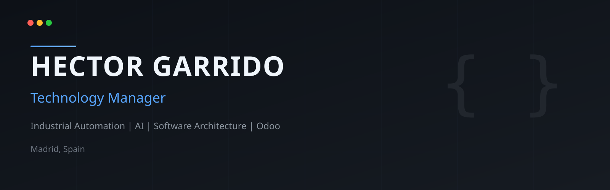

  

  

# Hi there, I'm Héctor Garrido 👋

### Technology Manager | Software Architect | Industrial Automation | AI | Odoo

I design solutions, lead technology, and work at the intersection of **software, industrial automation, and AI**.

I'm a **Technology Manager** passionate about building software that bridges **industrial automation, ERP systems and Artificial Intelligence**.

I enjoy designing scalable architectures, leading technical teams and transforming complex engineering challenges into software solutions.

Currently leading technology initiatives at **[TECNIC Bioprocess Solutions](https://www.tecnic.eu/)**.

---

## 🚀 Current Focus

- 🏭 Industrial Automation & Control Systems
- 🤖 AI for Software Engineering
- 🔗 ERP Integrations (Odoo)
- 🛡️ Secure NFC Traceability Systems
- ☁️ Infrastructure & DevOps
- ⚡ Software Architecture
- 📊 Process Digitalization

---

## 🛠 Tech Stack

### Languages

### Frameworks & ERP

### Infrastructure

### Areas

- Industrial Automation
- Software Architecture
- Artificial Intelligence
- DevOps
- ERP
- Embedded Systems
- System Integration

---

## 💼 Career

| Year | Position |
|------|----------|
| 2016 | Dynamics NAV Developer @ [Nubit Consulting](https://nubit.es) |
| 2019 | Odoo Consultant & Freelancer |
| 2024 | Technical Consulting Director @ [Ideas Positivas](https://ideaspositivas.es) |
| 2025 | Technology Manager @ [TECNIC](https://www.tecnic.eu/) |

---

## ⏱️ WakaTime Stats

  

> Conecta [WakaTime](https://wakatime.com) en VS Code o Cursor para que estas métricas reflejen tu actividad real de programación.

---

## 📈 GitHub Stats

  
  

---

## 🔥 GitHub Streak

  

---

## 📊 Activity Graph

  

---

## 🐍 Contribution Snake

  

---

## 🏆 GitHub Trophies

  

---

## 🌱 Currently Learning

- AI Agents
- Industrial AI
- Software Architecture
- Embedded Systems
- Cloud Infrastructure

---

## ⚡ Outside of Work

- 🥊 Boxing
- 🚁 FPV Drone Pilot
- 🐠 Aquascaping
- ☕ Coffee Addict
- 📚 Continuous Learner

---

## 🤝 Let's Connect

